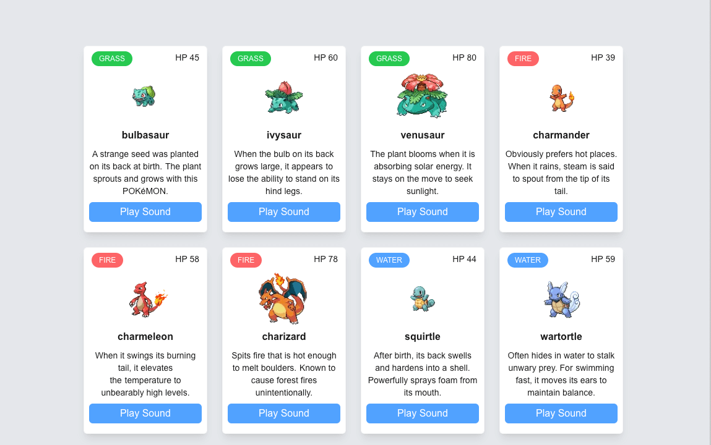

# Pokémon Card App

A simple Next.js app that fetches Pokémon data and displays interactive cards with name, type, HP, description, and cry sound.

## Features
- Fetches data from PokeAPI
- Displays type with Tailwind color
- Plays cry sound on click
- Shake animation on button press

## Preview

